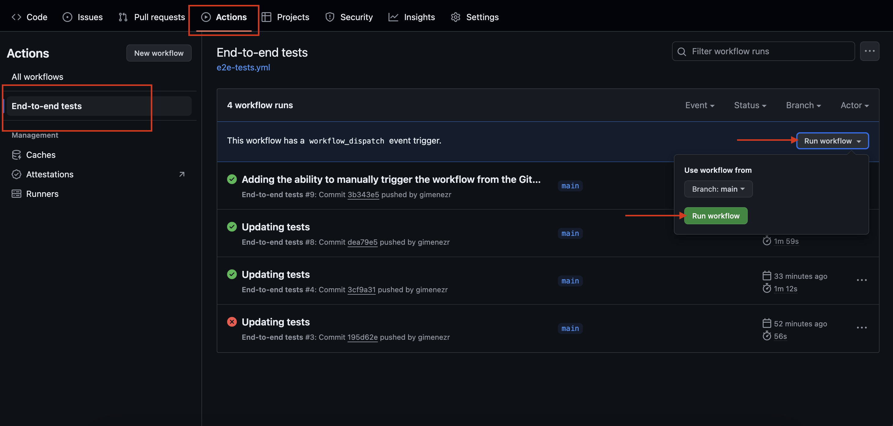

# UI tests

## Installation
To install the repository and its dependencies using npm, follow these steps:

```bash
npm ci
```

## Running Tests locally

> [!NOTE]
> 
> Create a `cypress.env.json` file with the corresponding user and password. Use `env.json` file as example

Opening Cypress dashboard
```bash
npm run cy:open
```

Running tests in headless mode

```bash
npx cypress run
```

## GitHub Actions Integration

Automated testing is set up using GitHub Actions:

1. Navigate to the Actions tab in your GitHub repository.
2. Select the workflow named `End-to-end tests`.
3. Click the Run workflow button on the right.
4. Wait for the workflow to complete.
5. To view the generated report: Go to the finished job. Scroll down and access the attached report.



## How to execute a dockerize environment
> [!NOTE]
> 
> Create a `.env.local` file with the corresponding user and password. Use .env file as example
> 
> 1. Create the docker image
> 
 ```bash
docker buildx build . -t ui-tests
```

> 2. Run the docker image with the tests

```bash
docker run -it --env-file=.env.local ui-tests:latest
```

## BDD scenarios

**Feature: User Login and Logout**

  Scenario: User successfully logs in with valid credentials and logs out
    **Given** the user is logged in
    **When** the user logs out
    **Then** the user should be redirected to the login page
    **And** the user should see a confirmation message that they have logged out

  Scenario: User attempts to log in with invalid credentials
    **Given** the user is on the login page
    **When** the user enters invalid credentials
    **Then** the user should see a message indicating invalid login credentials
    **And** the user should remain on the login page

  Scenario: User changes language on login page without affecting preferred language
    **Given** the user is on the login page
    **When** the user changes the language to Italian
    **And** the user logs in with valid credentials
    **Then** the user's dashboard should load in the user's preferred language
    **And** the user's preferred language should remain English
